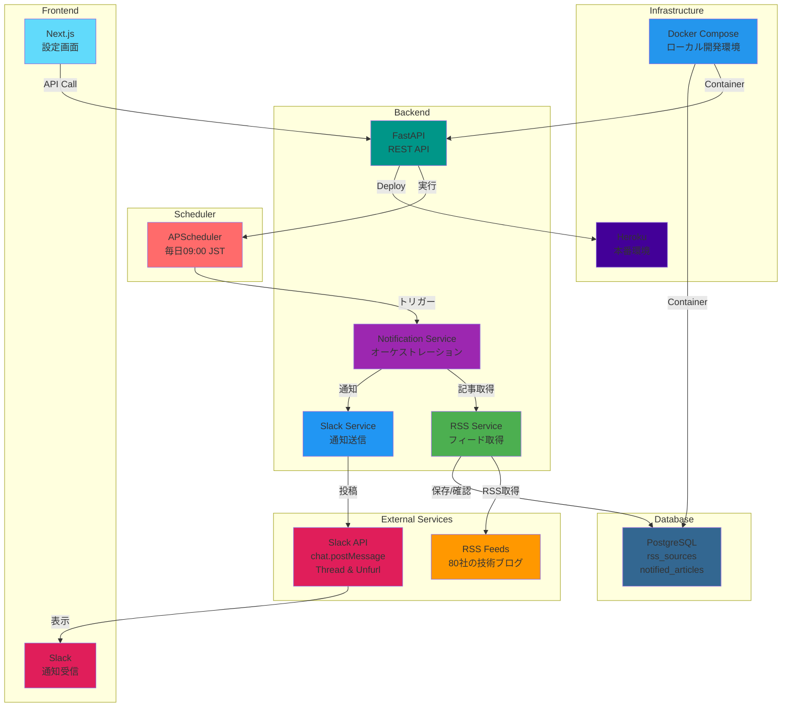
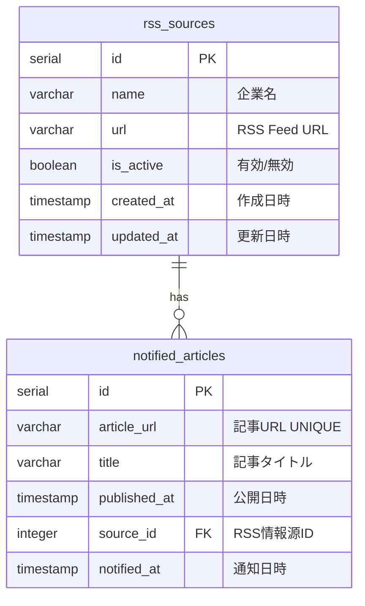

# Tech Blog Notification Bot

> 日本企業 80 社の技術ブログ RSS を監視し、新着記事を Slack に自動通知する Bot

---

## 📖 概要

日本の有力 IT 企業 80 社の技術ブログを毎日監視し、新着記事を Slack に自動通知するシステムです。スレッド機能と URL unfurl 機能を活用し、見やすく情報整理された通知を実現しています。

---

## 📺 デモ

<div align="center">


_実際のアプリケーションの動作デモ_

</div>

---

## 🏗️ システム構成



### 現在の構成

- **Frontend**: Slack（通知受信 UI、スレッド機能、unfurl 機能）
- **Backend**: FastAPI（RSS 巡回、通知管理）
- **Database**: PostgreSQL（RSS 情報源、通知履歴）

---

## 🛠️ 使用技術

### Backend

| 技術        | 用途                       |
| ----------- | -------------------------- |
| Python 3.11 | プログラミング言語         |
| FastAPI     | REST API フレームワーク    |
| SQLAlchemy  | ORM（データベース操作）    |
| feedparser  | RSS フィード解析           |
| APScheduler | スケジューラー（定期実行） |
| requests    | HTTP 通信                  |

### Database

| 技術       | 用途               |
| ---------- | ------------------ |
| PostgreSQL | メインデータベース |

### External Services

| 技術             | 用途               |
| ---------------- | ------------------ |
| Slack Bot API    | チャンネル通知     |
| chat.postMessage | メッセージ投稿     |
| Thread 機能      | スレッド返信       |
| Unfurl 機能      | URL プレビュー表示 |

### Infrastructure

| 技術                      | 用途                 |
| ------------------------- | -------------------- |
| Docker                    | コンテナ化           |
| Docker Compose            | ローカル開発環境     |
| Heroku                    | 本番環境ホスティング |
| Heroku Container Registry | Docker デプロイ      |
| Heroku Scheduler          | 定期実行             |

---

## 🗄️ データベース設計（ER 図）



---

## ✨ 主な機能

### 📰 RSS 巡回機能

- ✅ **80 社の技術ブログ監視**
  - メルカリ、サイバーエージェント、LINE、楽天、DeNA など
  - スタートアップから大手企業まで網羅
- 🕐 **定期実行**: 毎日 09:00（JST）に自動実行
- 📅 **期間フィルタ**: 過去 30 日以内の記事のみ取得
- 🚫 **キーワード除外**: イベント・採用情報を自動除外
  - 除外キーワード: 開催、お知らせ、募集、採用、Advent Calendar、出展、参加、イベント
- 🔄 **重複防止**: 通知済み記事を DB で管理

### 💬 Slack 通知機能

- 📱 **スレッド形式で通知**
  - メイン投稿: 記事数と統計情報のサマリー
  - スレッド内: 各記事の詳細（個別メッセージ）
- 🖼️ **URL unfurl 機能**
  - OGP 画像・タイトル・説明文を自動表示
  - 1 時間制限を回避（ハッシュフラグメント使用）
- 🔢 **記事 ID 表示**: #1, #2, #3... で参照しやすく
- 📊 **統計情報表示**
  - 監視中サイト数
  - 取得成功サイト数
  - エラー情報
- ⚠️ **エラーハンドリング**
  - RSS 取得失敗時のエラー詳細表示
  - 記事 0 件でも通知を送信

---

## 💡 工夫した点・技術的チャレンジ

### 1. Slack スレッド機能の活用

### 2. URL unfurl 1 時間制限の回避

### 3. 各記事を個別メッセージで投稿

### 4. 重複通知防止

### 5. HTML エンティティデコード対応

### 6. 記事 0 件でも必ず通知

### 7. エラー情報の可視化

---

## 📂 プロジェクト構造

```
slack-bot/
├── frontend/
├── backend/
│   ├── src/
│   │   ├── config/
│   │   │   ├── database.py         # DB接続設定
│   │   │   └── settings.py         # 環境変数管理
│   │   ├── models/
│   │   │   └── __init__.py         # RSSSource, NotifiedArticle
│   │   ├── services/
│   │   │   ├── rss_service.py      # RSS取得・解析
│   │   │   ├── slack_service.py    # Slack通知
│   │   │   └── notification_service.py  # オーケストレーション
│   │   └── main.py                 # FastAPI アプリケーション
│   ├── scripts/
│   │   ├── init_data.py            # 初期データ投入（80社）
│   │   └── reset_notifications.py  # 通知履歴リセット
│   ├── .env.example                # 環境変数テンプレート
│   ├── requirements.txt            # Python依存関係
│   └── Dockerfile                  # Dockerイメージ定義
│
├── docker-compose.yml              # ローカル開発環境
├── Dockerfile                      # Heroku用Dockerfile
├── heroku.yml                      # Heroku設定
├── SLACK_APP_SETUP.md              # Slack App設定手順
└── README.md
```

---

## 📊 監視対象企業（80 社）

### スタートアップ・メガベンチャー系（45 社）

メルカリ、サイバーエージェント、LINE、楽天、DeNA、クックパッド、ヤフー、リクルート、はてな、ミクシィ、GMO ペパボ、ZOZO、Sansan、SmartNews、Retty、ドワンゴ、カオナビ、Chatwork、eureka、freee、GREE、Gunosy、Indeed、Ubie、LayerX、Money Forward、CARTA HOLDINGS、ドリコム、Zlab、BASE、SmartHR、Timee、READYFOR、10X、ビズリーチ、Visional、プレイド、ココナラ、MICIN、スタディサプリ、Ateam、アンドパッド、ラクスル、カケハシ、Wantedly

### ゲーム会社系（8 社）

Cygames、コロプラ、アカツキ、QualiArts、gumi、KLab、セガ、Craft Egg

### 決済・金融系（7 社）

PayPay、GMO インターネット、GMO メディア、Kyash、bitFlyer、Coincheck、Moneytree

### メディア・広告系（5 社）

エムスリー、オプト、サイボウズ、pixiv、note

### 大手 IT・SIer 系（5 社）

NTT コミュニケーションズ、NTT データ、リクルートテクノロジーズ、富士通、日立製作所

### EC・マーケットプレイス系（5 社）

ヤプリ、オイシックス・ラ・大地、PKSHA Technology、ラクマ、Z ホールディングス

### その他有力企業（5 社）

弁護士ドットコム、Uzabase、トレタ、フィードフォース、ペライチ

---

## 🎯 今後の改善予定

- [ ] Web ダッシュボード（記事一覧・検索機能）
- [ ] 企業ごとの通知 ON/OFF 設定
- [ ] キーワードアラート機能
- [ ] 週次サマリーレポート
- [ ] 記事の人気度スコアリング
- [ ] カテゴリ別フィルタリング

---

## 📄 License

MIT License
